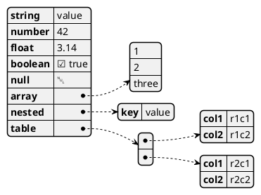
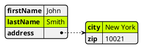
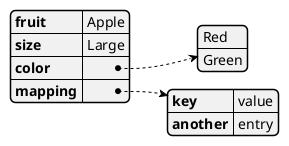
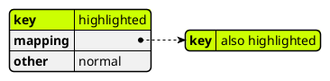
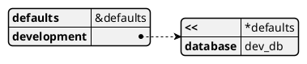
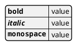

# PlantUML Complete Syntax Reference
*Based on PlantUML Language Reference Guide v1.2025.0 (607 pages, 27 chapters)*
*All diagram types documented from the official PDF.*

---

## @start / @end Tags — Complete List

| Tag pair | Diagram type |
|----------|-------------|
| `@startuml` / `@enduml` | Sequence, Class, Activity, Use Case, Component, Deployment, State, Timing, Object, ER, nwdiag, Archimate, Salt |
| `@startmindmap` / `@endmindmap` | Mind Map |
| `@startgantt` / `@endgantt` | Gantt Chart |
| `@startwbs` / `@endwbs` | Work Breakdown Structure |
| `@startsalt` / `@endsalt` | Wireframe (Salt) |
| `@startjson` / `@endjson` | JSON visualisation |
| `@startyaml` / `@endyaml` | YAML visualisation |
| `@startmath` / `@endmath` | AsciiMath formula |
| `@startlatex` / `@endlatex` | LaTeX/JLaTeXMath formula |
| `@startditaa` / `@endditaa` | Ditaa ASCII art diagram |
| `@startcreole` / `@endcreole` | Standalone Creole text |

---

## Ch 1 — Sequence Diagram

```plantuml
@startuml
' ── Participant types ─────────────────────────────
participant "Long Name" as A
actor       User
boundary    Frontend
control     Controller
entity      Model
database    DB
collections Pool
queue       MQ

' Rename with 'as'
participant "My actor" as B #red  ' with background colour

' ── Arrow styles ──────────────────────────────────
A -> B   : solid sync
A --> B  : dashed response
A ->> B  : thin solid
A -->> B : thin dashed
A ->x B  : lost message
A ->o B  : open arrowhead
A <-> B  : bidirectional
A o<->o B : both open arrowheads
A ->  B  : right
A <-  B  : left (cosmetic only in sequence)
A -[#red]> B  : coloured arrow

' ── Self-message ──────────────────────────────────
A -> A : self-call
A -> A : multiline\nmessage

' ── Activation / deactivation ─────────────────────
A -> B: call
activate B
B --> A: return
deactivate B
destroy B         ' marks with X
autoactivate on   ' global shortcut

' ── Shortcut activation syntax ────────────────────
A ->+ B : calls and activates B
B -->- A : returns and deactivates B

' ── Notes ─────────────────────────────────────────
note left of A  : left note
note right of B : right note
note over A, B  : spanning note
rnote over A    : round note
hnote over A    : hexagonal note
note over A
  Multi-line
  note
end note

' ── Grouping / frames ─────────────────────────────
group My group [label]
  A -> B
end
alt success
  A -> B
else failure [label]
  A -> C
end
opt [optional]
  A -> B
end
loop 5 times
  A -> B
end
par
  A -> B
else
  A -> C
end
critical
  A -> B
end
break
  A -> B
end
ref over A, B
  Other diagram
end ref

' ── Colour a group ────────────────────────────────
group#lightblue Coloured
  A -> B
end

' ── Secondary group label ─────────────────────────
group first label [second label]
  A -> B
end

' ── Dividers / delays ─────────────────────────────
== Section Title ==
... 5 minutes later ...
|||         ' small space
||50||      ' 50px space

' ── Autonumber ────────────────────────────────────
autonumber
autonumber 10
autonumber 10 5             ' start at 10, step 5
autonumber "<b>[000]"       ' format string
autonumber stop
autonumber resume
autonumber resume "<font color=red><b>Message 0"

' ── Incoming and outgoing messages ────────────────
[-> A : from outside
A ->] : to outside
[-> A : incoming
[<- A : outgoing response

' ── Short incoming/outgoing ───────────────────────
?-> A : short incoming
A ->? : short outgoing

' ── Anchors and duration (teoz pragma) ────────────
!pragma teoz true
{start} A -> B : start
B -> C : something
{end} C -> A : done
{start} <-> {end} : duration label

' ── Stereotypes and spots ─────────────────────────
participant "Bob" as Bob << Generated >>
participant Alice << (C,#ADD1B2) Testable >>

' ── Position of stereotypes ───────────────────────
skinparam stereotypePosition top    ' or bottom

' ── Participants encompass ─────────────────────────
box "Box Label" #LightBlue
  participant A
  participant B
end box

' ── Hide foot boxes ───────────────────────────────
hide footbox

' ── Remove participant ────────────────────────────
hide unlinked participant

' ── Mainframe ─────────────────────────────────────
mainframe title of diagram

' ── Participant creation ───────────────────────────
create A
A -> B : creates B during flow

' ── Return shorthand ──────────────────────────────
A -> B : call
return result

' ── Slanted / odd arrows ──────────────────────────
A -\ B : slanted right
A /- B : slanted left
A \\-- B : double slanted
A //-- B : double slanted
A ->/ B : odd arrow

' ── Parallel messages (teoz) ─────────────────────
!pragma teoz true
A -> B & A -> C : parallel

' ── Page title ───────────────────────────────────
title __Simple__ **title** on\nseveral lines
title
  Multi-line title
  using <u>HTML</u>
end title

' ── Splitting diagrams ────────────────────────────
A -> B : page 1
newpage
A -> B : page 2
newpage Title of page 3

' ── Skinparam (sequence-specific) ─────────────────
skinparam sequence {
  ArrowColor       DeepSkyBlue
  ArrowFontColor   DarkBlue
  LifeLineBorderColor blue
  LifeLineBackgroundColor #A9DCDF
  ParticipantBorderColor  DarkBlue
  ParticipantBackgroundColor DodgerBlue
  ParticipantFontName Impact
  ParticipantFontSize 17
  ParticipantFontColor #A9DCDF
  ActorBorderColor  DarkBlue
  ActorBackgroundColor DodgerBlue
  ActorFontColor   DarkBlue
  ActorFontSize    17
  ActorFontName    Aapex
}
skinparam responseMessageBelowArrow true
skinparam maxMessageSize 150   ' text wrapping
@enduml
```

---

## Ch 2 — Use Case Diagram

```plantuml
@startuml
left to right direction   ' or top to bottom (default)

' ── Actors ────────────────────────────────────────
actor User
actor :System\nActor: as SA   ' multi-line name
actor User <<human>>           ' stereotype
actor User #red                ' colour
:User: as U                    ' alternate syntax

' ── Business use cases ────────────────────────────
actor "Business Actor" as BA
usecase "Business\nUse Case" as BUC
BA -- BUC

' ── Use cases ─────────────────────────────────────
usecase "Login" as UC1
(View Data) as UC2           ' alternate syntax

' ── Use case description ──────────────────────────
usecase UC3 as "
  title
  --
  **Main Flow:**
  User does stuff
  ..Alternative..
  Error path
"

' ── Packages / rectangles ─────────────────────────
rectangle Application {
  usecase "UC1" as UC1
}
package System {
  usecase "UC2" as UC2
}

' ── Connections ───────────────────────────────────
User --> UC1
UC1 ..> UC2 : <<include>>
UC3 ..> UC1 : <<extend>>
UC3 -|> UC1              ' inheritance

' ── Notes ─────────────────────────────────────────
note "Note text" as N1
UC1 .. N1
note right of UC1 : inline note
note top of UC1
  multi-line note
end note

' ── Stereotypes ───────────────────────────────────
actor "Admin" <<Role>> as Admin
usecase "Delete" <<dangerous>> as Del

' ── Arrow direction ───────────────────────────────
User -up-> UC1
User -down-> UC2
User -left-> UC3
User -right-> UC4

' ── Arrow color and style ─────────────────────────
User -[#red]-> UC1
User -[thickness=3]-> UC2
User -[dashed,#blue]-> UC3

' ── JSON overlay on diagram ───────────────────────
json JSON_DATA {
   "a": "You can use JsonData",
   "on UC diagram": "like this"
}

' ── Skinparam ─────────────────────────────────────
skinparam actorStyle awesome   ' hollow | awesome
skinparam usecase {
  BackgroundColor DarkSeaGreen
  BorderColor DarkSlateGray
  ArrowColor Olive
}
@enduml
```

---

## Ch 3 — Class Diagram

```plantuml
@startuml
' ── Visibility ────────────────────────────────────
' + public   - private   # protected   ~ package

' ── Class types ───────────────────────────────────
class Foo
class Bar {
  +publicAttr : String
  -privateAttr : int
  #protectedAttr : double
  ~pkgAttr : boolean
  {static} staticAttr : long
  {abstract} abstractMethod() : void
  +method(arg:Type) : ReturnType
}
abstract class AbstractBase {
  {abstract} doSomething() : void
}
interface Serializable {
  +serialize() : String
}
annotation MyAnnotation
enum Color {
  RED
  GREEN
  BLUE
}

' ── Generics ──────────────────────────────────────
class Stack<T> {
  +push(T item)
  +pop() : T
}
class Map<K,V>

' ── Relationships ─────────────────────────────────
ClassA    <|--  ClassB        ' inheritance (extends)
Interface <|..  ClassC        ' realization (implements)
ClassD    o--   ClassE        ' aggregation (hollow diamond)
ClassD    *--   ClassF        ' composition (filled diamond)
ClassG    -->   ClassH        ' dependency (dashed arrow)
ClassG    ..>   ClassH        ' usage
ClassI    --    ClassJ        ' association
ClassK "1" *-- "0..*" ClassL : has > ' with multiplicities + label

' ── Using extends/implements keywords ──────────────
class ArrayList implements List
class ArrayList extends AbstractList
class A extends B, C {      ' multiple inheritance
}

' ── Lollipop / socket notation ────────────────────
class A
class B
A --() lollipop    ' provided interface (ball)
A -()- socket      ' required interface (socket/cup)
A -(0- B           ' ball-and-socket

' ── Bidirectional association ─────────────────────
ClassA -- ClassB
ClassA --> ClassB : uses >
ClassA <-- ClassB : < used by

' ── Arrow direction hints ─────────────────────────
ClassA -up-|> ClassB
ClassA -down-> ClassB
ClassA -left--> ClassB
ClassA -right--* ClassB

' ── Notes ─────────────────────────────────────────
note "This is a note" as N1
ClassA .. N1
note right of ClassA : inline note
note left of ClassA : left inline note
note top of ClassA : top note
note bottom of ClassA
  multi-line note
end note
note on link #red : note on relationship line

' ── Note on field ─────────────────────────────────
class Foo {
  +name : String
  ..
  +method() : void
}
note right of Foo::name : This is the name field

' ── Spot / circle in stereotype ───────────────────
class Testable << (T,#FF7700) Test >>
interface "I" as I << (S,#ADD1B2) Singleton >>

' ── Specific Spot ─────────────────────────────────
spot S #red

' ── Namespaces and packages ───────────────────────
package "com.example" #DDDDDD {
  class Foo
  class Bar
}
namespace net.example {
  class Baz {
    +method()
  }
  class Qux
}
' Accessing across namespaces
net.example.Baz --> net.example.Qux

' ── Class body separators ─────────────────────────
class Line {
  +x1 : int
  +y1 : int
  --
  +draw() : void
  ..
  String toString()
  ==
  {static} count : int
}

' ── Creole / HTML in class body ───────────────────
class Styled {
  **bold** attribute
  //italic// attribute
  <b>html bold</b>
}

' ── Hide / Show / Remove ──────────────────────────
hide empty members
hide empty fields
hide empty methods
hide members
hide fields
hide methods
hide attributes
hide circle          ' remove the circle/spot
hide stereotype      ' remove stereotype display
hide <<marker>> circle
hide @unlinked       ' hide classes with no connections
remove @unlinked     ' remove classes with no connections
hide Foo             ' hide a specific class
remove Foo           ' remove a specific class
show <<Interface>> stereotype

' ── $tag-based hide/remove ────────────────────────
class $TaggedClass <<$my_tag>>
hide $my_tag         ' hide by tag
remove $my_tag
remove *             ' remove all
restore $my_tag      ' restore tagged

' ── Display JSON Data on Class diagram ────────────
class Foo

json SideData {
   "key": "value"
}

' ── Skinparam ─────────────────────────────────────
skinparam class {
  BackgroundColor     PaleGreen
  ArrowColor          DarkGreen
  BorderColor         Black
  AttributeIconSize   0     ' hide attribute type icons
}
skinparam classAttributeIconSize 0
@enduml
```

---

## Ch 4 — Object Diagram

```plantuml
@startuml
' ── Object instances ──────────────────────────────
object firstObject
object "My Object" as obj2
object obj3 {
  name = "Alice"
  age  = 30
}

' ── Object with field values ──────────────────────
map "associative array" as m {
  key => value
  k2  => v2
}

' ── Relationships (same arrows as class) ──────────
obj3 <|-- obj4       ' specialization
obj3 *-- obj5        ' composition
obj3 o-- "4" obj6    ' aggregation with cardinality
obj3 .. obj4 : label ' dependency with label

' ── Adding/linking map ────────────────────────────
map steps {
  Step 1 => Phase A
  Step 2 => Phase B
}
@enduml
```

---

## Ch 5 — Activity Diagram (LEGACY)

> **Note:** This is the old syntax. Use the new syntax (Ch 6) for new diagrams.
> The legacy syntax uses `(*)` and `-->` style.

```plantuml
@startuml
(*) --> "First Action"
"First Action" --> (*)

' ── Label on arrows ───────────────────────────────
(*) --> "Action 1"
-->[label here] "Action 2"
--> (*)

' ── Directional arrows ────────────────────────────
(*) -up-> "Top"
(*) -down-> "Bottom" 
(*) -right-> "Right"     ' or -> (default)
(*) -left-> "Left"

' ── Branches ──────────────────────────────────────
(*) --> "Check"
if "Condition?" then
  -->[true]  "True Action"
  --> (*)
else
  -->[false] "False Action"
  --> (*)
endif

' ── Nested branches ───────────────────────────────
(*) --> if "Test" then
  -->[true] "A1"
  if "" then
    -> "A3"
  else
    --> "A4"
  endif
else
  -->[false] "B1"
  --> (*)
endif

' ── Synchronization bars (fork/join) ──────────────
(*) --> ===SYNC===
===SYNC=== --> "A"
===SYNC=== --> "B"
"A" --> ===JOIN===
"B" --> ===JOIN===
===JOIN=== --> (*)

' ── Long action descriptions ──────────────────────
(*) --> "
  This is a long action
  description spanning
  several lines
"

' ── Notes ─────────────────────────────────────────
(*) --> "Action"
note right : inline note

note right
  multi-line note
end note

' ── Partitions (swimlanes) ────────────────────────
partition "Lane A" {
  (*) --> "Action in A"
}
partition "Lane B" {
  "Action in A" --> "Action in B"
  --> (*)
}

' ── Colours ───────────────────────────────────────
(*) --> "Action" #red
"Action" --> (*) #lightblue

' ── Skinparam ─────────────────────────────────────
skinparam activity {
  BackgroundColor #FFFACD
  BorderColor     #A9A9A9
  ArrowColor      DarkBlue
}
@enduml
```

---

## Ch 6 — Activity Diagram (New Syntax — PREFERRED)

```plantuml
@startuml
start

' ── Simple actions ────────────────────────────────
:Simple action;
:Multi-line\naction;
:Action with <b>HTML</b>;
:Coloured action; #lightblue
:Bold; <<style>>          ' applies a style

' ── Stop / end / kill / detach ───────────────────
stop       ' normal end point
end        ' synonym for stop
kill       ' abnormal termination (X marker)
detach     ' arrow with no endpoint

' ── Conditional ───────────────────────────────────
if (condition?) then (yes)
  :true path;
else (no)
  :false path;
endif

if (A?) then
  :A;
elseif (B?) then
  :B;
else
  :default;
endif

' ── Switch/case ───────────────────────────────────
switch (value?)
case (1)
  :case one;
case (2)
  :case two;
case (3)
  :case three;
endswitch

' ── Stop within condition ─────────────────────────
if (error?) then (yes)
  #red:Error;
  kill
endif
:Continue;

' ── Repeat loop ───────────────────────────────────
repeat
  :do work;
  backward: retry note;      ' backward arrow label
repeat while (again?) is (yes)
not (no)                     ' exit label

' ── While loop ────────────────────────────────────
while (still running?) is (yes)
  :loop body;
endwhile (done)

' ── Break on a repeat loop ────────────────────────
repeat
  :act;
  if (break?) then (yes)
    break
  endif
repeat while (loop?)

' ── Goto and Label ────────────────────────────────
label skip_here
:Action 1;
if (skip?) then (yes)
  goto skip_here
endif
:Action 2;

' ── Fork (parallel) ───────────────────────────────
fork
  :branch 1;
fork again
  :branch 2;
fork again
  :branch 3;
end fork              ' join (all branches must complete)
end merge             ' merge (first to finish wins)

' ── Split (multiple outputs) ──────────────────────
split
  :path A;
split again
  :path B;
end split

' ── Notes ─────────────────────────────────────────
:action;
note right : right-side note
note left  : left-side note
note right
  multi-line note
end note

' ── Connector (named goto on same page) ───────────
(A)          ' circle connector named A — reference
(A)          ' reference to connector A elsewhere
:action;
(B)
detach

' ── Connector colour ──────────────────────────────
(A) #red

' ── Grouping / partition ──────────────────────────
group "Group Name"
  :action;
end group

partition "Partition" {
  :action;
}

' ── Swimlanes ─────────────────────────────────────
|Swimlane1|
start
:step 1;
|#AntiqueWhite|Swimlane2|
:step 2;
|Swimlane1|
stop

' ── Swimlane with alias ───────────────────────────
|#palegreen|f| fisherman
|c| cook
|f|
start
:go fish;
|c|
stop

' ── Lines without arrows ──────────────────────────
:action;
-        ' horizontal line separator (like divider)

' ── Arrow styles ──────────────────────────────────
:action;
-> label on arrow;
:next;

' ── Colours ───────────────────────────────────────
#red:error action;
#lightblue:info action;
:action; #green

' ── SDL shapes (§6.21) ────────────────────────────
:Input action;   <<input>>
:Output action;  <<output>>
:Procedure;      <<procedure>>
:Load;           <<load>>
:Save;           <<save>>
:Continuous;     <<continuous>>
:Task;           <<task>>

' SDL shape via angle brackets in text:
:start; <<start>>
:stop;  <<stop>>

' ── Condition Style (§6.23) ───────────────────────
skinparam conditionStyle inside      ' default
skinparam conditionStyle diamond
skinparam conditionStyle InsideDiamond

' ── Condition End Style (§6.24) ───────────────────
skinparam conditionEndStyle hline    ' horizontal line
skinparam conditionEndStyle diamond

' ── Style command (preferred over skinparam) ──────
<style>
activityDiagram {
  BackgroundColor #FFFACD
  BorderColor #A9A9A9
  diamond {
    BackgroundColor #E8E8E8
  }
  arrow {
    FontColor Blue
  }
  swimlane {
    BorderColor Gray
    titleBackgroundColor LightBlue
  }
}
</style>
@enduml
```

---

## Ch 7 — Component Diagram

```plantuml
@startuml
' ── Components ────────────────────────────────────
[Component]
component "Long Name" as C1
component C2 <<stereotype>>
component C3 #LightYellow

' ── Interfaces ────────────────────────────────────
() "Interface" as I1
interface "Named Interface" as I2

' ── Connections ───────────────────────────────────
[A] --> [B]           ' dependency (arrow)
[A] ..> [B]           ' usage (dashed)
[A] --  [B]           ' link
[A] --( I1            ' required interface (open socket)
I1  )-- [B]           ' provided interface (filled ball)
[A] -0)- [B]          ' ball-and-socket
[A] -(0- [B]          ' socket (cup)
[A] -(0)- [B]         ' full ball-and-socket

' ── Arrow direction ───────────────────────────────
[A] -up->    [B]
[A] -down->  [B]
[A] -left->  [B]
[A] -right-> [B]

' ── Grouping ──────────────────────────────────────
package "Package" {
  [A]
  [B]
}
node "Server" {
  [C]
}
frame "Browser" {
  [D]
}
cloud "AWS" {
  [E]
}
database "DB Layer" {
  [F]
}
folder "Folder" {
  [G]
}
queue "Queue" {
  [H]
}
stack "Stack" {
  [I]
}
rectangle "Box" {
  [J]
}
collections "Collections" {
  [K]
}

' ── Long descriptions ─────────────────────────────
[Component] as C
note right of C : note text

' ── Individual colours ────────────────────────────
[Red Component] #red
[Blue Component] #lightblue

' ── Sprite in stereotype ──────────────────────────
!include <tupadr3/common>
!include <tupadr3/font-awesome/database>
[DB] <<$fa-database>>

' ── Ports (§7.18) ─────────────────────────────────
component C {
  port p1
  port p2
}
C::p1 --> [Other]

' ── Use UML2 notation ─────────────────────────────
skinparam componentStyle uml2

' ── Hide/Remove unlinked ──────────────────────────
hide @unlinked
remove @unlinked

' ── Skinparam ─────────────────────────────────────
skinparam component {
  BackgroundColor  LightCyan
  BorderColor      DarkCyan
  ArrowColor       DarkCyan
  Style            rectangle   ' or uml2
}
@enduml
```

---

## Ch 8 — Deployment Diagram

```plantuml
@startuml
' ── Element keywords ──────────────────────────────
actor        User
agent        Agent
artifact     "app.war"
boundary     Boundary
card         Card
circle       Circle
cloud        "Cloud"
collections  Coll
component    Comp
control      Control
database     DB
entity       Entity
file         "config.xml"
folder       "src/"
frame        Frame
hexagon      Hex
interface    Iface
label        "Label"
node         "Web Server" as WS
package      Pkg
queue        Queue
rectangle    Rect
stack        Stack
storage      Storage
usecase      UC

' ── Nesting ───────────────────────────────────────
node "App Server" {
  component "WAR"
  database  "H2"
}
node "Web Server" {
  component "Nginx"
}
node "DB Server" {
  database "PostgreSQL" {
    collections "Tables"
  }
}

' ── Packages and nested ───────────────────────────
package "Backend" {
  node "API" {
    component "REST Handler"
  }
}

' ── Linking / arrows ──────────────────────────────
WS --> AppServer : HTTP/8080
AppServer ..> DB   : JDBC
[Comp] --> (Iface) : uses

' ── Bracketed arrow style ─────────────────────────
node A
node B
A -[bold,dashed]-> B
A -[#red,dashed]-> B
A -[dotted]-> B
A -[hidden]-> B    ' force layout without visible arrow

' ── Arrow color and style ─────────────────────────
A -[#red]-> B
A -[thickness=3]-> B

' ── Alias ─────────────────────────────────────────
node "Application Server" as AppSrv

' ── Round corners ─────────────────────────────────
skinparam rectangleRoundCorner 10
skinparam nodeRoundCorner 10

' ── Ports (§8.19) ─────────────────────────────────
node WebServer {
  port 80
  port 443
}
WebServer::80  <-- Internet
WebServer::443 <-- Internet

' ── Orientation ───────────────────────────────────
left to right direction
top to bottom direction

' ── Mixing deployment elements ────────────────────
actor "User" as u
node "Browser" as b
u --> b

' ── Display JSON on deployment ────────────────────
json side {
  "key": "value"
}

' ── Skinparam ─────────────────────────────────────
skinparam node {
  BackgroundColor LightYellow
  BorderColor     DarkOrange
}
skinparam artifact {
  BackgroundColor PaleGreen
}
@enduml
```

---

## Ch 9 — State Diagram

```plantuml
@startuml
' ── Basic states ──────────────────────────────────
[*] --> Idle        ' initial pseudo-state to Idle
Idle --> Active : trigger
Active --> Idle : reset / action
Active --> [*]  : done

' ── State description (long) ──────────────────────
state Active : This is the\\nactive state
state "My State" as MS
state MS : description line 1
state MS : description line 2

' ── Alias ─────────────────────────────────────────
state "Very Long State Name" as VL
[*] --> VL

' ── Change state rendering ────────────────────────
state Foo #line.dashed
state Bar #line.dotted
state Baz #line.bold

' ── Composite / nested states ─────────────────────
state Active {
  [*] --> SubA
  SubA --> SubB : go
  SubB --> [*]
}

' ── Long state name in composite ──────────────────
state "A Long State" as ls {
  ls : entry / do something
  ls : exit  / undo something
  ls : do    / background work
  [*] --> s1
  s1  --> s2
}

' ── History ───────────────────────────────────────
state Composite {
  [H]  --> Sub1      ' shallow history
  [H*] --> Sub1      ' deep history
}

' ── Fork and join ─────────────────────────────────
state fork  <<fork>>
state join  <<join>>
[*]      --> fork
fork     --> State1
fork     --> State2
State1   --> join
State2   --> join
join     --> [*]

' ── Concurrent states ─────────────────────────────
state Concurrent {
  [*] --> A
  --
  [*] --> B
  --
  [*] --> C
}

' ── Conditional / choice ──────────────────────────
state choice <<choice>>
[*]     --> choice
choice  --> S1 : [x > 0]
choice  --> S2 : [else]

' ── Entry/exit points ─────────────────────────────
state SM {
  state "entry"  <<entryPoint>>  as ep
  state "exit"   <<exitPoint>>   as xp
  state "terminate" <<terminate>> as tp
  ep --> S1
  S1 --> xp
}

' ── Point ─────────────────────────────────────────
state s1 as ""            ' empty = point state

' ── Pin ──────────────────────────────────────────
state s1 <<inputPin>>     ' input pin
state s2 <<outputPin>>    ' output pin
state s3 <<expansionInput>>
state s4 <<expansionOutput>>

' ── Expansion region ──────────────────────────────
state "Expansion" <<expansionRegion>> {
  [*] --> es1
}

' ── Arrow direction ───────────────────────────────
Idle -up->    Active
Idle -down->  Done
Idle -left->  Error
Idle -right-> Running

' ── Line style ────────────────────────────────────
Active -[#red]-> Idle
Active -[dashed]-> Idle
Active -[dotted]-> Idle
Active -[bold]-> Idle

' ── Notes ─────────────────────────────────────────
note right of Active : active state note
note left  of Idle   : idle state note
note top   of Active : top note
note bottom of Active : bottom note
note on link
  This note is on the transition
end note

' ── More on notes ─────────────────────────────────
state Foo
note "Note as N1" as N1
Foo .. N1

' ── Inline colour ─────────────────────────────────
state Active #LightBlue
state Active #yellow;line:green;text:white

' ── Stereotypes full example ──────────────────────
hide empty description
state "Stereotype" <<trigger>>
state S1
state S2 <<end>>

' ── JSON Data on State diagram ────────────────────
state Foo
json J {
  "key":"value"
}

' ── Style for nested state body ───────────────────
<style>
stateDiagram {
  BackgroundColor LightYellow
  arrow {
    FontColor Blue
  }
}
</style>

' ── Skinparam ─────────────────────────────────────
skinparam state {
  BackgroundColor     LightBlue
  BorderColor         DeepSkyBlue
  ArrowColor          Navy
  StartColor          Black
  EndColor            Black
  AttributeFontColor  DarkBlue
}
@enduml
```

---

## Ch 10 — Timing Diagram

```plantuml
@startuml
' ── Participant types ──────────────────────────────
robust   "Robust Signal"  as R   ' shows state transitions
concise  "Concise Signal" as C   ' simplified data movement
binary   "Binary Signal"  as B   ' high/low only
clock    "Clock"          as CLK with period 10
clock    "Clock2" as CLK2 with period 20 pulse 5 offset 3
analog   "Analog"         as A   ' continuous/interpolated

' ── Time points using @ ────────────────────────────
@0
R   is Idle
C   is Idle
B   is low
A   is 0

@50
R   is Processing
C   is Waiting
B   is high
A   is 3

@100
R   is Done
B   is low
A   is 1

@150
R   is Idle

' ── Relative time ─────────────────────────────────
@+10
R is Processing

@+50
R is Idle

' ── Adding messages between signals ───────────────
@0
R -> C : trigger
@50
C -> R : response

' ── Anchor points ─────────────────────────────────
@10 as A1
@50 as A2
A1 <-> A2 : duration label

' ── Participant-oriented (§10.6) ──────────────────
@startuml
concise "A" as a
concise "B" as b

a -> b@+20 : trigger
@0
a is Idle
b is Idle
@+10
a is Sending
b@+20 is Receiving
@enduml

' ── Setting scale ─────────────────────────────────
scale 5 as 150 pixels

' ── Initial state with @ ──────────────────────────
robust "Signal" as S
@0
S is off
@10
S is on

' ── Intricated / nested states ────────────────────
robust "Web Browser" as WB {
  0 is Idle
  +200 is Loading
  +100 is Rendering
  +50 is Idle
}

' ── Highlight / colour sections ───────────────────
highlight 50 to 100 #Pink : error window
highlight 150 to 200 #LightBlue

' ── Skinparam ─────────────────────────────────────
skinparam timingDiagram {
  BackgroundColor LightYellow
}
@enduml
```

---

## Ch 11 — JSON Display



Highlighting specific keys:


Different highlight styles:

```plantuml
@startjson
<style>
jsonDiagram {
  highlight {
    BackgroundColor red
    FontColor white
    FontStyle bold
  }
}
</style>
#highlight "key"
{ "key": "highlighted", "other": "normal" }
@endjson
```


Minimal / empty examples:
```plantuml
@startjson
null
@endjson
```
```plantuml
@startjson
[]
@endjson
```
```plantuml
@startjson
{}
@endjson
```

---

## Ch 12 — YAML Display



Highlighting:


Using aliases:


Creole in YAML:


---

## Ch 13 — Network Diagram (nwdiag)

```plantuml
@startuml
nwdiag {
  ' ── Define networks ─────────────────────────────
  network dmz {
    address = "210.x.x.x/24"
    web01 [address = "210.x.x.1"]
    web02 [address = "210.x.x.2"]
  }

  network internal {
    address = "172.x.x.x/24"
    web01 [address = "172.x.x.1"]
    db01
    db02
  }
}
@enduml
```

Multiple addresses and extended syntax:
```plantuml
@startuml
nwdiag {
  ' ── Grouping nodes ─────────────────────────────
  group {
    color = "#FFAAAA"
    db01
    db02
  }

  network dmz {
    web01
    web02
  }
  network internal {
    web01
    db01
    db02
  }
}
@enduml
```

Using sprites / icons:
```plantuml
@startuml
!include <tupadr3/common>
!include <tupadr3/font-awesome/database>
!include <tupadr3/font-awesome/server>

nwdiag {
  network internet {
    web [shape = cloud]
  }
  network dmz {
    web
    app [description = "App server\n<$fa-server>"]
  }
  network backend {
    app
    db  [description = "<$fa-database>", color = "#A9DCDF"]
  }
}
@enduml
```

OpenIconic / peer networks:
```plantuml
@startuml
nwdiag {
  ' ── Same node on multiple networks ─────────────
  network n1 {
    gateway
    server1
  }
  network n2 {
    gateway
    server2
  }

  ' ── Peer networks (direct) ──────────────────────
  peer [description = "peer link"]
  server1 -- peer
  peer    -- server2
}
@enduml
```

---

## Ch 14 — Wireframe / Salt

```plantuml
@startsalt
' or: @startuml followed by 'salt' keyword

{
  ' ── Basic widgets ─────────────────────────────
  Just text
  [Button]
  [Button] | [Cancel]
  "Text input    "
  ^DropDown^

  ' ── Radio and checkbox ───────────────────────
  (o) Selected radio  | () Unselected
  [X] Checked box     | [] Unchecked

  ' ── Scrollbar ────────────────────────────────
  {S
    Scrollable content
    more content
  }

  ' ── Separator (horizontal line) ──────────────
  .
  ==
  ~~
  --

  ' ── Grid / table ─────────────────────────────
  {#
    r1c1 | r1c2 | r1c3
    r2c1 | r2c2 | r2c3
  }

  ' ── Tree widget ──────────────────────────────
  {T
    + Root
    ++ Child 1
    +++ Grandchild
    ++ Child 2
  }

  ' ── Tree table ───────────────────────────────
  {T
    + Name | Size | Date
    + Root |      |
    ++ File1.txt | 1KB | 2024
    ++ File2.txt | 2KB | 2024
  }

  ' ── Tabs ──────────────────────────────────────
  {/
    Tab 1 | Tab 2 | Tab 3
    Content of selected tab
  }

  ' ── Group box ─────────────────────────────────
  {^"Group Title"
    Content inside group
    [Button]
  }

  ' ── Enclosing brackets ────────────────────────
  {
    First
    {
      inner1 | inner2
    }
    Last
  }
}
@endsalt
```

Text area and open brackets:
```plantuml
@startsalt
{+
  This is a scrollable
  "Name "
  "Password "
  [  OK  ]
}
@endsalt
```

---

## Ch 15 — Archimate Diagram

```plantuml
@startuml
' ── Archimate element keyword ─────────────────────
archimate #Technology "VPN Server" as vpnServerA <<technology-device>>
archimate #Business   "Customer"   as customer   <<business-actor>>
archimate #Application "App"       as app        <<application-component>>

' ── Colour categories ─────────────────────────────
' Business, Application, Motivation, Strategy,
' Technology, Physical, Implementation

rectangle GO   #lightgreen
rectangle STOP #red
rectangle WAIT #orange

' ── Junctions (using preprocessor) ───────────────
!define Junction_Or  circle #black
!define Junction_And circle #whitesmoke
Junction_And JunctionAnd
Junction_Or  JunctionOr

GO   -up-> JunctionOr
STOP -up-> JunctionOr
STOP -down-> JunctionAnd
WAIT -down-> JunctionAnd

' ── Using Archimate StdLib macros ─────────────────
!include <archimate/Archimate>

Motivation_Stakeholder(StakeholderElement, "Stakeholder")
Business_Service(BService, "Business Service")

Rel_Composition(StakeholderElement, BService, "composes")
Rel_Composition_Down(StakeholderElement, BService, "down")

' ── Relationship types ────────────────────────────
' Aggregation, Association, Composition,
' Realization, Specialization

' ── Direction suffixes ────────────────────────────
' _Up, _Down, _Left, _Right

' ── Listing available sprites ─────────────────────
' listsprite  (in @startuml)
@enduml
```

---

## Ch 16 — Gantt Chart

```plantuml
@startgantt
' ── Project start ─────────────────────────────────
Project starts 2025-01-01
Project starts the 1st of january 2025

' ── Scale / printscale ───────────────────────────
printscale daily
printscale weekly
printscale monthly
printscale quarterly
printscale yearly

projectscale weekly
projectscale monthly zoom 3    ' zoom level

' ── Tasks ─────────────────────────────────────────
[Design]      lasts 5 days
[Development] lasts 10 days
[Testing]     lasts 3 days

' ── One-line task shorthand ───────────────────────
[Task] starts D+5 and lasts 3 days

' ── Constraints / dependencies ────────────────────
[Design]      -> [Development]       ' start after end
[Development] -> [Testing]
[Design]      -up-> [Testing]        ' directional arrows

' ── Short names / alias ───────────────────────────
[Prototype design end] as [TASK1] lasts 13 days
[TASK1] -> [Testing]

' ── Tasks with same name ──────────────────────────
[Task 1] as [t1] lasts 5 days
[Task 1] as [t2] starts at [t1]'s end and lasts 5 days

' ── Colours ───────────────────────────────────────
[Design] is colored in Coral/LightCoral
[Development] is colored in LightBlue/Blue
' Format: background/border

' ── Completion status ─────────────────────────────
[Design] is 50% completed
[Testing] is 100% completed
[Dev] is 0% completed

' ── Milestones ────────────────────────────────────
[Milestone] happens at [Development]'s end
[Launch] happens 2025-03-01
[Milestone] is colored in red

' ── Hyperlinks ────────────────────────────────────
[Task] links to [[https://example.com]]

' ── Closed days ───────────────────────────────────
saturday are closed
sunday are closed
2025-01-01 is closed          ' specific date
2025-12-25 is named [Christmas]

' ── Named date ranges ─────────────────────────────
2025-01-18 to 2025-01-22 are named [Sprint Review]
2025-01-18 to 2025-01-22 are colored in salmon

' ── Gantt with 'then' keyword ─────────────────────
[Task A] lasts 5 days
then [Task B] lasts 3 days    ' starts after A ends
then [Task C] lasts 2 days

' ── Zoom ─────────────────────────────────────────
printscale weekly zoom 4
printscale daily zoom 2
@endgantt
```

---

## Ch 17 — MindMap

```plantuml
@startmindmap
' ── OrgMode syntax ────────────────────────────────
* Root topic
** Branch A
*** Leaf A1
*** Leaf A2
** Branch B
*** Leaf B1
**** Deep leaf

' ── Left side (minus prefix) ─────────────────────
-- Left branch
--- Left leaf

' ── Multiroot ────────────────────────────────────
+ Root 1
++ Child 1
-- Root 2 (left)
--- Left child

' ── Markdown syntax ───────────────────────────────
@startmindmap
# Root
## Level 2
### Level 3
-- Left 2
--- Left 3
@endmindmap

' ── Arithmetic notation ───────────────────────────
@startmindmap
OrgMode Style
* root node
  * some first level node
    * second level node
    * another second level node
  * another first level node
@endmindmap

' ── Removing the box ──────────────────────────────
* Root
** box node
**_ boxless node     ' underscore removes box
**[#lightblue] coloured

' ── Colours ───────────────────────────────────────
*[#Orange] root
**[#lightblue] Left
**[#lightgreen] Right

' ── Changing diagram direction ────────────────────
@startmindmap
<style>
mindmapDiagram {
  .green {
    BackgroundColor lightgreen
  }
  .red {
    BackgroundColor tomato
  }
}
</style>
* root <<green>>
** child <<red>>
@endmindmap

' ── Change node shape ─────────────────────────────
@startmindmap
* root
** normal box
**_ no box
** <<cloud>> cloud node
@endmindmap
@endmindmap
```

---

## Ch 18 — Work Breakdown Structure (WBS)

```plantuml
@startwbs
' ── OrgMode syntax ────────────────────────────────
* Project
** Phase 1
*** Task 1.1
*** Task 1.2
** Phase 2
*** Task 2.1

' ── Arithmetic notation ───────────────────────────
+ Project
 + Phase 1
  + Task 1.1
  + Task 1.2
 + Phase 2
  + Task 2.1

' ── Changing direction ───────────────────────────
@startwbs
<style>
wbsDiagram {
  Linecolor black
  arrow {
    LineColor black
  }
}
</style>
* Root
** Left branch
*** Leaf
@endwbs

' ── Remove box ────────────────────────────────────
* Root
** normal
**_ no box

' ── Colours ───────────────────────────────────────
*[#Orange] Root
**[#lightblue] Branch

' ── Word wrap ─────────────────────────────────────
@startwbs
<style>
wbsDiagram {
  node {
    MaximumWidth 200
  }
}
</style>
* A very long\nroot node name
@endwbs

' ── Arrows between WBS elements ───────────────────
@startwbs
* root
** a
** b
a -> b : connects
@endwbs
@endwbs
```

---

## Ch 19 — Maths (AsciiMath / JLaTeXMath)

Inline in diagram:
```plantuml
@startuml
:<math>int_0^1f(x)dx</math>;
:<math>x^2+y_1+z_12^34</math>;
note right
  <math>d/dxf(x)=lim_(h->0)(f(x+h)-f(x))/h</math>
end note

:<latex>\int_0^1f(x)dx</latex>;
:<latex>x^2+y_1+z_{12}^{34}</latex>;
note right
  <latex>\dfrac{d}{dx}f(x)=\lim\limits_{h \to 0}\dfrac{f(x+h)-f(x)}{h}</latex>
end note

Bob -> Alice : <math>ax^2+bx+c=0</math>
Alice --> Bob : <math>x = (-b+-sqrt(b^2-4ac))/(2a)</math>
@enduml
```

Standalone:
```plantuml
@startmath
f(t)=(a_0)/2 + sum_(n=1)^ooa_ncos((npit)/L)+sum_(n=1)^oo b_n\ sin((npit)/L)
@endmath
```

```plantuml
@startlatex
\sum_{i=0}^{n-1} (a_i + b_i^2)
@endlatex
```

> **Note:** JLaTeXMath requires separate jar files: `batik-all-1.7.jar`, `jlatexmath-minimal-1.0.3.jar`, `jlm_cyrillic.jar`, `jlm_greek.jar` in the same folder as plantuml.jar.

---

## Ch 20 — Entity Relationship (Information Engineering)

```plantuml
@startuml
' ── IE notation ───────────────────────────────────
' * = mandatory (not null)
entity "User" as user {
  *user_id : INTEGER <<PK>>
  --
  *name    : VARCHAR(100)
  email    : VARCHAR(255)
  phone    : VARCHAR(20)
  created_at : TIMESTAMP
}

entity "Post" as post {
  *post_id  : INTEGER <<PK>>
  --
  *user_id  : INTEGER <<FK>>
  *title    : VARCHAR(200)
  body      : TEXT
  published : BOOLEAN
}

entity "Comment" as comment {
  *comment_id : INTEGER <<PK>>
  --
  *post_id    : INTEGER <<FK>>
  *user_id    : INTEGER <<FK>>
  body        : TEXT
}

entity "Tag" as tag {
  *tag_id : INTEGER <<PK>>
  --
  *name   : VARCHAR(50)
}

entity "PostTag" as posttag {
  *post_id : INTEGER <<PK, FK>>
  *tag_id  : INTEGER <<PK, FK>>
}

' ── Relations ─────────────────────────────────────
' Cardinality notation:
'   ||   exactly one
'   o|   zero or one
'   o{   zero or more (o many)
'   |{   one or more

user  ||--o{ post    : "writes"
post  ||--o{ comment : "has"
user  ||--o{ comment : "writes"
post  }o--o{ tag     : "tagged"
post  ||--o{ posttag : ""
tag   ||--o{ posttag : ""

' ── Complete example with styling ─────────────────
skinparam entity {
  BackgroundColor  LightYellow
  BorderColor      DarkOrange
}
@enduml
```

---

## Ch 21 — Common Commands (All Diagrams)

```plantuml
@startuml
' ── Comments ──────────────────────────────────────
' Single-line comment (apostrophe)
/' Multi-line
   block comment '/
/' Inline block '/ Alice -> Bob : test

' ── Zoom / scale ──────────────────────────────────
scale 1.5
scale 200 width
scale 200 height
scale 200*100        ' exact dimensions
scale max 300*200

' ── Title ─────────────────────────────────────────
title Simple title
title My title\non two lines
title __underlined__ **bold** //italic//
title
  Multi-line
  <u>formatted</u> title
end title

skinparam titleBorderRoundCorner 15
skinparam titleBorderThickness   2
skinparam titleBorderColor       red
skinparam titleBackgroundColor   Aqua-CadetBlue

' ── Caption (below diagram) ───────────────────────
caption Figure 1: System Architecture

' ── Footer and Header ─────────────────────────────
header
  <font color=red>Warning:</font>
  Do not use in production
end header

footer
  Page %page% of %lastpage%
end footer

header Left header text
footer Right footer text

' ── Legend ────────────────────────────────────────
legend
  Legend content
  * Item 1
  * Item 2
end legend

legend top left
  Top-left legend
end legend

legend right
  Right-side legend
end legend

' ── Splitting / newpage ───────────────────────────
Alice -> Bob : page 1
newpage
Alice -> Bob : page 2
newpage Title of next page
Alice -> Bob : page 3

' ── Appendix ──────────────────────────────────────
' @startuml content, then:
Alice -> Bob : normal
@enduml
@startuml
Alice -> Bob : appendix page
@enduml

' ── Mainframe ─────────────────────────────────────
mainframe My Mainframe Title

' ── Background colour ─────────────────────────────
skinparam backgroundColor #FFFACD
skinparam backgroundColor transparent

' ── Hide unlinked ─────────────────────────────────
hide @unlinked

' ── Pragma ────────────────────────────────────────
!pragma teoz true           ' enable teoz layout
!pragma layout smetana      ' Graphviz-free layout
!pragma svgSize 200*200
@enduml
```

---

## Ch 22 — Creole (Rich Text Formatting)

Creole works in **all diagram types** for text in notes, labels, titles, etc.

```plantuml
@startuml
note right
  ' ── Emphasis ──────────────────────────────────
  This is **bold**
  This is //italic//
  This is ""monospaced""
  This is --stricken-out--
  This is __underlined__
  This is ~~wave-underlined~~

  ' ── Escape with tilde ─────────────────────────
  This is not ~__underlined__
  This is not ~""monospaced""

  ' ── Headings ─────────────────────────────────
  = Extra-large heading
  == Large heading
  === Medium heading
  ==== Small heading

  ' ── Lists ────────────────────────────────────
  * Bullet item
  * Second item
  ** Sub-item
  # Numbered item
  # Second item
  ## Sub-numbered item

  ' ── Horizontal lines ─────────────────────────
  ----
  ====
  ....
  ____

  ' ── Links ───────────────────────────────────
  [[https://plantuml.com]]
  [[https://plantuml.com PlantUML]]
  [[https://plantuml.com{Tooltip} PlantUML]]

  ' ── Code block ───────────────────────────────
  <code>
  this is code
  with multiple lines
  </code>

  ' ── Tables ──────────────────────────────────
  | Col1  | Col2  | Col3  |
  | R1C1  | R1C2  | R1C3  |
  | R2C1  | R2C2  | R2C3  |

  ' ── Emoji ────────────────────────────────────
  <:thumbsup:>  <:heart:>  <:smile:>

  ' ── HTML tags (mixed with Creole) ────────────
  <b>bold HTML</b>
  <i>italic</i>
  <u>underlined</u>
  <s>strikethrough</s>
  <w>wave underline</w>
  <color:#FF0000>red text</color>
  <back:#AAAAAA>grey background</back>
  <size:18>large text</size>
  <font:monospaced>mono</font>
  <plain>plain inside bold</plain>
  
  
  &#XXXX;          ' Unicode by decimal
  <U+XXXX>         ' Unicode by hex
end note
@enduml
```

---

## Ch 23 — Sprites (Icons)

```plantuml
@startuml
' ── Define a sprite (16-column hex grid) ──────────
sprite $foo1 {
  FFFFFFFFFFFFFFF
  F0123456789ABCF
  F0123456789ABCF
  FFFFFFFFFFFFFFF
}
Alice -> Bob : <$foo1>
Alice -> Bob : <$foo1{scale=2}>
Alice -> Bob : <$foo1{color=red}>

' ── Inline SVG sprite ─────────────────────────────
sprite $svgSprite [100x100/16z] {
  ' base64-encoded deflated SVG data
}

' ── Encoding a sprite from image ──────────────────
' Use: java -jar plantuml.jar -encodesprite 16 image.png

' ── Changing sprite colours ───────────────────────
sprite $foo {
  FFFFFFFFFFFFFFF
}
Alice -> Bob : Testing <$foo,scale=2,color=#FF0000>

' ── Importing sprites from StdLib ─────────────────
!include <tupadr3/common>
!include <tupadr3/font-awesome/database>
!include <tupadr3/font-awesome/server>
!include <awslib/AWSCommon>
!include <awslib/AWSSimplified>

[Comp] <<$fa-database>>
node N <<$fa-server>>

' ── Using OpenIconic ──────────────────────────────
!include <openiconic/openiconic>

actor a as "<$person>"
database d as "<$database>"

' ── Listing available sprites ─────────────────────
!include <tupadr3/common>
listsprite     ' inside @startuml block to list all

' ── StdLib sprite list ────────────────────────────
' listsprites
' or run: java -jar plantuml.jar -listsprites
@enduml
```

---

## Ch 24 — Skinparam Command

> **⚠ Important:** `skinparam` is being gradually superseded by the `<style>` command (CSS-like). Both are still supported, but `<style>` handles more complex cases.

```plantuml
@startuml
' ── Global skinparams ─────────────────────────────
skinparam backgroundColor     #FEFEFE
skinparam backgroundColor     transparent
skinparam monochrome          true
skinparam monochrome          reverse   ' inverted B&W
skinparam shadowing           false
skinparam handwritten         true
skinparam defaultFontName     "DejaVu Sans"
skinparam defaultFontSize     13
skinparam defaultFontStyle    bold
skinparam defaultFontColor    DarkBlue
skinparam defaultTextAlignment center
skinparam dpi                 150       ' raster output DPI
skinparam nodesep             80        ' horizontal spacing
skinparam ranksep             100       ' vertical spacing
skinparam linetype            ortho     ' or polyline
skinparam roundcorner         15
skinparam guillemet           false     ' hide <<>>
skinparam padding             5
skinparam svgLinkTarget       _blank
skinparam maxMessageSize      150

' ── Nested skinparam (avoids repetition) ──────────
skinparam sequence {
  ArrowColor         DeepSkyBlue
  ArrowFontColor     DarkBlue
  LifeLineBorderColor blue
  ParticipantBackgroundColor LightYellow
  ParticipantBorderColor     DarkBlue
}
skinparam class {
  BackgroundColor    PaleGreen
  BorderColor        DarkGreen
  ArrowColor         Olive
  AttributeIconSize  0
}
skinparam activity {
  BackgroundColor    #FFFACD
  BorderColor        Gray
  ArrowColor         DarkBlue
  DiamondBackgroundColor Silver
  DiamondBorderColor Gray
}
skinparam note {
  BackgroundColor    LemonChiffon
  BorderColor        Gold
}
skinparam component {
  BackgroundColor    LightSalmon
  BorderColor        OrangeRed
  Style              uml2     ' or rectangle
}
skinparam usecase {
  BackgroundColor    DarkSeaGreen
  BorderColor        DarkSlateGray
  ArrowColor         Olive
  ActorBorderColor   DarkBlue
  ActorFontName      Aapex
}
skinparam state {
  BackgroundColor    LightBlue
  BorderColor        DeepSkyBlue
  ArrowColor         Navy
}
skinparam package {
  BackgroundColor    GhostWhite
  BorderColor        LightSlateGray
}
skinparam node {
  BackgroundColor    LightYellow
  BorderColor        DarkOrange
}
skinparam database {
  BackgroundColor    LightCyan
  BorderColor        Teal
}

' ── Style (modern alternative to skinparam) ───────
<style>
sequenceDiagram {
  BackgroundColor LightYellow
  arrow {
    FontColor Blue
    LineColor Red
  }
  participant {
    BackgroundColor LightGreen
    BorderColor Green
  }
}
classDiagram {
  class {
    BackgroundColor LightBlue
    BorderColor Navy
  }
  arrow {
    FontColor DarkBlue
  }
}
activityDiagram {
  BackgroundColor #FFFACD
  diamond {
    BackgroundColor Pink
  }
  arrow {
    FontColor Blue
    LineColor Blue
  }
  swimlane {
    BorderColor Gray
    titleBackgroundColor LightBlue
  }
}
</style>

' ── Themes ────────────────────────────────────────
!theme plain
!theme cerulean
!theme crt-amber
!theme crt-green
!theme cyborg
!theme hacker
!theme lightgray
!theme materia
!theme metal
!theme minty
!theme radar
!theme rose
!theme reddress-darkred
!theme sandstone
!theme silver
!theme sketchy
!theme sketchy-outline
!theme slate
!theme spacelab
!theme superhero
!theme toy
!theme united
!theme vibrant

' ── Reverse colours ───────────────────────────────
skinparam monochrome reverse   ' white text on black
skinparam classBackgroundColor Wheat
skinparam classBorderColor     SeaGreen

' ── Font colour ───────────────────────────────────
skinparam classFontColor       DarkBlue
skinparam classFontSize        14
skinparam classFontStyle       bold

' ── Text alignment ────────────────────────────────
skinparam defaultTextAlignment left
skinparam defaultTextAlignment center
skinparam defaultTextAlignment right
@enduml
```

---

## Ch 25 — Preprocessing

```plantuml
@startuml
' ── Variable definition ───────────────────────────
!$a = 42
!$b = "hello"
!$c = true
!$json = { "name": "Alice", "age": 30 }

' ── Conditional assignment (only if not set) ──────
!$x ?= "default"

' ── Boolean values ────────────────────────────────
' 0 = false, any non-zero int or any string = true

' ── Boolean operators ─────────────────────────────
' &&  ||  ()   !

' ── Boolean builtin functions ─────────────────────
!$t = %true()
!$f = %false()
!$n = %not($t)
!$bv = %boolval("1")

' ── Conditions ────────────────────────────────────
!if ($a == 42)
  Alice -> Bob : a is 42
!elseif ($b == "hello")
  Alice -> Bob : b is hello
!else
  Alice -> Bob : neither
!endif

' ── While loop ────────────────────────────────────
!$i = 0
!while $i < 3
  Alice -> Bob : step $i
  !$i = $i + 1
!endwhile

' ── Procedures (no return value) ──────────────────
!procedure $box($alias, $label = "default")
  rectangle $alias as "$label"
!endprocedure

$box(myBox, "My Box")

' ── Return functions ──────────────────────────────
!function $double($n)
  !return $n + $n
!endfunction

Alice -> Bob : $double(5) = $double(5)

' ── Default argument values ───────────────────────
!function $inc($value, $step = 1)
  !return $value + $step
!endfunction

Alice -> Bob : $inc(3) = $inc(3)
Alice -> Bob : $inc(3, 2) = $inc(3, 2)

' ── Unquoted procedure/function ───────────────────
!unquoted function id($text) !return $text
Alice -> id(Bob) : hello

' ── Keyword arguments (Python-style) ──────────────
!unquoted procedure $element($alias, $description = "", $label = "", $size = 12)
  rectangle $alias as "==$label==\n$description"
!endprocedure
$element(myAlias, $size = 10, $label = "My Label")

' ── Including files ───────────────────────────────
!include path/to/file.puml
!include path/to/file.puml!1       ' second diagram block
!include path/to/file.puml!MY_ID   ' named block
!include_many path/to/file.puml    ' allow multiple includes
!include_once path/to/file.puml    ' error if included twice

' ── Subpart includes ──────────────────────────────
' In file: !startsub SECTION ... !endsub
!includesub file.puml!SECTION

' ── Themes ────────────────────────────────────────
!theme cerulean
!theme superhero

' ── Define / undef ────────────────────────────────
!define MAX_SIZE 100
!define ARROW ->
!undef MAX_SIZE

' ── ifdef / ifndef ────────────────────────────────
!ifdef DEBUG
  note : Debug mode
!endif
!ifndef PRODUCTION
  note : Not production
!endif

' ── Checking variable defined ─────────────────────
!if %variable_defined("MY_VAR")
  Alice -> Bob : defined
!endif

' ── Log and assert ────────────────────────────────
!log This message goes to stderr
!assert ($a == 42) : "a must be 42"

' ── Builtin functions (complete list) ─────────────
' String:
'   %string(expr)       convert to string
'   %strlen(str)        string length
'   %substr(str,start)  substring from start
'   %substr(str,start,len) substring
'   %strpos(str,sub)    find position (-1 if not found)
'   %upper(str)         uppercase
'   %lower(str)         lowercase
'   %trim(str)          trim whitespace
'   %intval(str)        parse string to integer
'   %newline()          insert newline character

' Math:
'   %int(num)           integer part
'   %mod(a,b)           modulo
'   %abs(n)             absolute value
'   %sqrt(n)            square root
'   %random()           random 0..32767
'   %random(n)          random 0..n
'   %random(min,max)    random min..max

' Color:
'   %darken(color, pct)    darken color by pct%
'   %lighten(color, pct)   lighten color
'   %is_dark(color)        returns bool
'   %is_light(color)       returns bool
'   %hsl_color(h,s,l)      HSL to RGBa
'   %hsl_color(h,s,l,a)    with alpha

' System:
'   %date("format")        current date/time
'   %dirpath()             current file directory
'   %filename()            current filename
'   %filenameNoExtension() filename without extension
'   %getenv("VAR")         environment variable
'   %load_json("file.json") load JSON file

' Type checking:
'   %variable_defined("name") check if variable exists
'   %not(expr)              boolean not
'   %true()                 boolean true constant
'   %false()                boolean false constant
'   %boolval(expr)          to boolean

' Dynamic invocation:
'   %invoke_procedure("$name", args...)
'   %call_user_func("$name", args...)

' JSON:
'   %str2json(str)          parse JSON string to variable
'   %json2str(json)         serialize JSON to string
'   %size(json_array)       array length

Alice -> Bob : date is %date("yyyy-MM-dd")
@enduml
```

---

## Ch 26 — Unicode

```plantuml
@startuml
' ── Unicode is supported natively ─────────────────
() "Σύστημα" as Sys
Sys - [Πυρήνας]

' ── Character references ──────────────────────────
Alice -> Bob : &#9829;    ' ♥ (decimal)
Alice -> Bob : <U+2665>   ' ♥ (hex Unicode)

' ── Emoji ─────────────────────────────────────────
Alice -> Bob : <:thumbsup:>
Alice -> Bob : <:smile:>
Alice -> Bob : <:heart:>

' ── Charset flag (CLI) ────────────────────────────
' java -jar plantuml.jar -charset UTF-8 file.puml

' ── Available charsets (typical): ─────────────────
' ISO-8859-1, UTF-8, UTF-16BE, UTF-16LE, UTF-16
@enduml
```

---

## Ch 27 — Standard Library (StdLib)

```plantuml
@startuml
' ── List all stdlib folders ───────────────────────
stdlib
@enduml
```

```bash
# CLI: list stdlib
java -jar plantuml.jar -stdlib

# Extract full stdlib sources locally
java -jar plantuml.jar -extractstdlib
# All files extracted to ./stdlib/
```

Key libraries included:

```plantuml
' ── ArchiMate ─────────────────────────────────────
!include <archimate/Archimate>
Motivation_Stakeholder(S, "Stakeholder")
Business_Service(BS, "Business Service")
Rel_Composition(S, BS, "composes")

' ── Amazon AWS ────────────────────────────────────
!include <awslib/AWSCommon>
!include <awslib/AWSSimplified>
!include <awslib/Compute/EC2>
!include <awslib/Storage/S3>
EC2(myEC2, "My EC2", "t2.micro")
S3(myBucket, "My Bucket", "Standard")
myEC2 --> myBucket

' ── Azure ─────────────────────────────────────────
!include <azure/AzureCommon>
!include <azure/Compute/AzureVirtualMachine>
AzureVirtualMachine(vm, "My VM", "Standard D2")

' ── Tupadr3 (Font Awesome, Devicons) ──────────────
!include <tupadr3/common>
!include <tupadr3/font-awesome/database>
!include <tupadr3/font-awesome/server>
!include <tupadr3/devicons/postgresql>
database DB as "<$fa-database>"
node App as "<$fa-server>"

' ── C4 Architecture ───────────────────────────────
!include <C4/C4_Context>
Person(user, "User", "Uses the system")
System(system, "System", "Does things")
Rel(user, system, "Uses")

!include <C4/C4_Container>
Container(app, "App", "Java", "Main app")
ContainerDb(db, "Database", "PostgreSQL")
Rel(app, db, "Reads/Writes")

!include <C4/C4_Component>
Component(auth, "Auth", "JWT", "Handles auth")

' ── CloudOgu ──────────────────────────────────────
!include <cloudogu/common>
!include <cloudogu/dogus/jenkins>

' ── Kubernetes ────────────────────────────────────
!include <kubernetes/k8s-sprites-unlabeled-25pct>

' ── Elastic ───────────────────────────────────────
!include <elastic/common>
!include <elastic/elasticsearch/elasticsearch>

' ── GCP (Google Cloud) ────────────────────────────
!include <gcp/GCPCommon>
!include <gcp/Compute/AppEngine>

' ── EDGY ─────────────────────────────────────────
!include <edgy/common>

' ── Listing sprites from an included library ──────
listsprite
@enduml
```

---

## Ch — Ditaa (ASCII Art to Diagram)

> Ditaa is included in PlantUML releases. Renders ASCII art as diagrams.

```plantuml
@startditaa
+--------+   +-------+    +-------+
|        | --+ ditaa +--> |       |
|  Text  |   +-------+    |diagram|
|Document|   |!magic!|    |       |
|     {d}|   |       |    |       |
+---+----+   +-------+    +-------+
    :                         ^
    |       Lots of work      |
    +-------------------------+
@endditaa
```

Ditaa options:
```
-E or --no-separation      : disable edge separation
-S or --no-shadows         : disable drop shadows
-s or --scale N            : set scale
--round-corners            : use rounded corners
@startditaa(scale=2)
...
@endditaa
```

---

## Quick Cheat Sheet

**Sequence arrows:**
```
->   sync       -->  dashed/response
->>  thin        -->> thin dashed
->x  lost        ->o  open arrowhead
<->  bidirectional    ->+ activate  -->- deactivate
[->  incoming    ->]  outgoing
```

**Class relationships:**
```
<|--  extends        <|..  implements
o--   aggregation    *--   composition
-->   dependency     ..>   usage
--    association
"1" *-- "0..*"  with cardinality
```

**ER cardinality:**
```
||   exactly one     o|   zero or one
o{   zero or more    |{   one or more
```

**Common skinparams (universal):**
```plantuml
skinparam backgroundColor transparent
skinparam shadowing false
skinparam monochrome true
skinparam handwritten true
skinparam defaultFontName "Arial"
!theme cerulean
```

**Layout pragmas:**
```plantuml
!pragma layout smetana      ' no Graphviz needed
!pragma teoz true           ' teoz engine
skinparam linetype ortho
skinparam nodesep 80
skinparam ranksep 100
```
